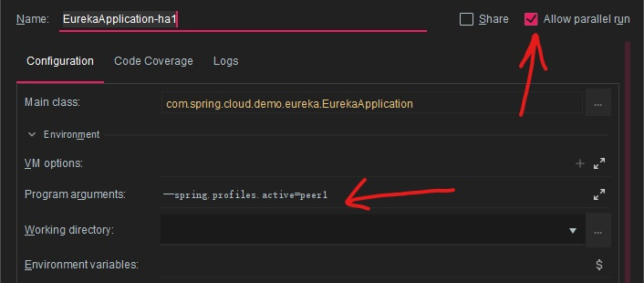

# 前言

spring-cloud为基础的微服务架构，所有的微服务都需要注册到注册中心，如果这个注册中心阻塞或者宕机，那么整个系统都将无法继续正常提供服务，所以，这里就需要对注册中心进行集群部署，换言之，实现高可用。

实现的高可用的思想是：通过集群部署Eureka，并使Eureka之间相互注册，这样，当其中一台Eureka宕机不可用时，此时仍有一台服务注册可用。

<!--more-->

# server端配置

创建一个Eureka服务，创建pom.xml，依赖如下。

```xml
<?xml version="1.0" encoding="UTF-8"?>
<project xmlns="http://maven.apache.org/POM/4.0.0" xmlns:xsi="http://www.w3.org/2001/XMLSchema-instance"
         xsi:schemaLocation="http://maven.apache.org/POM/4.0.0 http://maven.apache.org/xsd/maven-4.0.0.xsd">
    <modelVersion>4.0.0</modelVersion>

    <parent>
        <groupId>com.example</groupId>
        <artifactId>spring-cloud-demo-dependencies</artifactId>
        <version>1.0.0-SNAPSHOT</version>
        <relativePath>../spring-cloud-demo-dependencies/pom.xml</relativePath>
    </parent>

    <artifactId>spring-cloud-demo-eureka</artifactId>
    <packaging>jar</packaging>

    <name>spring-cloud-demo-eureka</name>
    <url>http://www.funtl.com</url>
    <inceptionYear>2018-Now</inceptionYear>

    <dependencies>
        <!-- Spring Boot Begin -->
        <dependency>
            <groupId>org.springframework.boot</groupId>
            <artifactId>spring-boot-starter-test</artifactId>
            <scope>test</scope>
        </dependency>
        <!-- Spring Boot End -->

        <!-- Spring Cloud Begin -->
        <dependency>
            <groupId>org.springframework.cloud</groupId>
            <artifactId>spring-cloud-starter-netflix-eureka-server</artifactId>
        </dependency>
        <!-- Spring Cloud End -->

        <dependency>
            <groupId>javax.xml.bind</groupId>
            <artifactId>jaxb-api</artifactId>
            <version>2.3.0</version>
        </dependency>
        <dependency>
            <groupId>com.sun.xml.bind</groupId>
            <artifactId>jaxb-impl</artifactId>
            <version>2.3.0</version>
        </dependency>
        <dependency>
            <groupId>org.glassfish.jaxb</groupId>
            <artifactId>jaxb-runtime</artifactId>
            <version>2.3.0</version>
        </dependency>
        <dependency>
            <groupId>javax.activation</groupId>
            <artifactId>activation</artifactId>
            <version>1.1.1</version>
        </dependency>
        <dependency>
            <groupId>org.springframework.cloud</groupId>
            <artifactId>spring-cloud-starter-zipkin</artifactId>
        </dependency>


    </dependencies>

    <build>
        <plugins>
            <plugin>
                <groupId>org.springframework.boot</groupId>
                <artifactId>spring-boot-maven-plugin</artifactId>
                <configuration>
                    <mainClass>com.spring.cloud.demo.eureka.EurekaApplication</mainClass>
                </configuration>
            </plugin>

            <plugin>
                <groupId>org.springframework.boot</groupId>
                <artifactId>spring-boot-maven-plugin</artifactId>
            </plugin>
        </plugins>
    </build>
</project>
```

# 配置文件（properties）

因为我们要启动两台Eureka服务器，所以我们需要创建两个配置文件：`application-peer1.properties`和`application-peer2.properties`。配置分别如下：

```properties
spring.application.name=spring-cloud-demo-eureka
server.port=8761
eureka.instance.hostname=peer1
eureka.client.serviceUrl.defaultZone=http://peer2:8661/eureka
# 表示是否注册自身到eureka服务器
eureka.client.register-with-eureka=false
# 是否从eureka上获取注册信息
eureka.client.fetch-registry=false
```

```properties
spring.application.name=spring-cloud-demo-eureka
server.port=8661
eureka.instance.hostname=peer2
eureka.client.serviceUrl.defaultZone=http://peer1:8761/eureka
# 表示是否注册自身到eureka服务器
eureka.client.register-with-eureka=false
# 是否从eureka上获取注册信息
eureka.client.fetch-registry=false
```

此处可以看到，在line 4，我们将peer注册到peer2上，将peer2注册到peer1上，从而实现相互注册。

# 配置文件（host）

修改C:\Windows\System32\drivers\etc\hosts，在文件末添加两行如下：

```
127.0.0.1 peer1
127.0.0.1 peer2
```

**许多高可用的Eureka配置里都要设置hosts文件，它是必须的吗？**

不是必须的，配置hosts文件的目的是使各个Eureka的eureka.instance.hostname不同。

Eureka互相注册要求各个Eureka实例的eureka.instance.hostname不同，如果相同，则会被Eureka标记为unavailable-replicas。我们最终把eureka.instance.hostname取了${spring.cloud.client.ipAddress}的值，这个值取的是当前启动Eureka的机器的IP，这样虽然配置一样但却自动区分了每台机器的Eureka，这时我们再取prefer-ip-address: true，就可以确保机器优先使用IP而不是到hosts解析域名。

# Server端

## 启动类

在启动类上加上EnableEurekaServer注解即可。

```java
@SpringBootApplication
@EnableEurekaServer
public class EurekaServerApplication {

	public static void main(String[] args) {
		SpringApplication.run(EurekaServerApplication.class, args);
	}
```

## 启动服务

添加两个启动项，分别设置启动配置为`–spring.profiles.active=peer1`和`–spring.profiles.active=peer2` ，表示不同的配置文件启动Eureka。此时服务端便配置完成了。



# Client端

## 依赖

新建一个`admin-service`服务，依赖文件`pom.xml` 如下：

```xml
<?xml version="1.0" encoding="UTF-8"?>
<project xmlns="http://maven.apache.org/POM/4.0.0" xmlns:xsi="http://www.w3.org/2001/XMLSchema-instance"
         xsi:schemaLocation="http://maven.apache.org/POM/4.0.0 http://maven.apache.org/xsd/maven-4.0.0.xsd">
    <modelVersion>4.0.0</modelVersion>

    <parent>
        <groupId>com.example</groupId>
        <artifactId>spring-cloud-demo-dependencies</artifactId>
        <version>1.0.0-SNAPSHOT</version>
        <relativePath>../spring-cloud-demo-dependencies/pom.xml</relativePath>
    </parent>

    <artifactId>spring-cloud-demo-service-admin</artifactId>
    <packaging>jar</packaging>

    <name>spring-cloud-demo-service-admin</name>
    <url>http://www.funtl.com</url>
    <inceptionYear>2018-Now</inceptionYear>

    <dependencies>
        <!-- Spring Boot Begin -->
        <dependency>
            <groupId>org.springframework.boot</groupId>
            <artifactId>spring-boot-starter-test</artifactId>
            <scope>test</scope>
        </dependency>
        <!-- Spring Boot End -->

        <!-- Spring Cloud Begin -->
        <dependency>
            <groupId>org.springframework.cloud</groupId>
            <artifactId>spring-cloud-starter-netflix-eureka-server</artifactId>
        </dependency>
        <!-- Spring Cloud End -->

        <!--熔断器依赖-->
        <dependency>
            <groupId>org.springframework.cloud</groupId>
            <artifactId>spring-cloud-starter-netflix-hystrix</artifactId>
        </dependency>

        <dependency>
            <groupId>org.springframework.cloud</groupId>
            <artifactId>spring-cloud-starter-zipkin</artifactId>
        </dependency>
    </dependencies>

    <build>
        <plugins>
            <plugin>
                <groupId>org.springframework.boot</groupId>
                <artifactId>spring-boot-maven-plugin</artifactId>
                <configuration>
                    <mainClass>com.spring.cloud.demo.service.admin.ServiceAdminApplication</mainClass>
                </configuration>
            </plugin>
        </plugins>
    </build>
</project>
```

## 配置

application.yml如下

```yml
spring:
  application:
    name: spring-cloud-demo-service-admin
  zipkin:
    base-url: http://localhost:9411
server:
  port: 8763
eureka:
  client:
    serviceUrl:
      defaultZone: http://peer1:8761/eureka/,http://peer2:8661/eureka/
```

defaultZone这里代表eureka server的地址，我们将两个Eureka地址都填上去，将服务注册到两台Eureka服务器上，这样当一台Eureka服务器宕机，服务依旧可用。

## 启动类

在启动类上加注解eurekaClient注解

```java
@SpringBootApplication
@EnableEurekaClient
@EnableHystrix
@EnableDiscoveryClient
public class ServiceAdminApplication {              //服务端
    public static void main(String[] args) {
        //第一个参数ServiceAdminApplication.class就是Spring应用的入口类；
        // 第二个参数args是启动Spring应用的命令行参数，该参数可以在Spring应用中被访问
        SpringApplication.run(ServiceAdminApplication.class, args);
    }
}
```
此时启动ServiceAdmin服务，可以看到ServiceAdmin服务同时注册到了两台Eureka服务器。