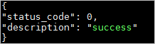

# 概述

本次安装采用 Ubuntu Server X64 16.04 LTS 版本安装 kubernetes 集群环境集群节点为 1 主 2 从模式。

创建三台虚拟机，分别命名如下：

- Ubuntu Server 16.04 X64 Kubernetes Master
- Ubuntu Server 16.04 X64 Kubernetes Slave1
- Ubuntu Server 16.04 X64 Kubernetes Slave2

对虚拟机系统的配置：

- 关闭交换空间：`sudo swapoff -a`
- 避免开机启动交换空间：注释 `/etc/fstab` 中的 `swap`
- 关闭防火墙：`ufw disable`


<!--more-->

# 安装前的准备

## 对操作系统的准备

#### 关闭交换空间

```bash
swapoff -a
```


#### 避免开机启动交换空间

```bash
# 注释 swap 开头的行
vi /etc/fstab
```


#### 关闭防火墙

```bash
ufw disable
```


#### 配置 DNS

```bash
# 取消 DNS 行注释，并增加 DNS 配置如：114.114.114.114，修改后重启下计算机
vi /etc/systemd/resolved.conf
```

## 安装Docker

此处不作赘述，可参见[Docker安装与简介](http://giottolee.com/2019/05/21/Docker-Help/)，本文中采取的是脚本安装方式，如脚本安装不成功，可使用APT安装方式。

## 修改主机名

在同一局域网中主机名不应该相同，所以我们需要做修改，下列操作步骤为修改 **18.04** 版本的 Hostname，如果是 `16.04 `或以下版本则直接修改 `/etc/hostname` 里的名称即可

### 查看当前 Hostname

```bash
# 查看当前主机名
hostnamectl
# 显示如下内容
   Static hostname: ubuntu
         Icon name: computer-vm
           Chassis: vm
        Machine ID: 33011e0a95094672b99a198eff07f652
           Boot ID: dc856039f0d24164a9f8a50c506be96d
    Virtualization: vmware
  Operating System: Ubuntu 18.04.2 LTS
            Kernel: Linux 4.15.0-48-generic
      Architecture: x86-64
```


### 修改 Hostname

```bash
# 使用 hostnamectl 命令修改，其中 kubernetes-master 为新的主机名
hostnamectl set-hostname kubernetes-master
```


### 修改 cloud.cfg

如果 `cloud-init package` 安装了，需要修改 `cloud.cfg` 文件。该软件包通常缺省安装用于处理 cloud。


```bash
# 如果有该文件
vi /etc/cloud/cloud.cfg

# 该配置默认为 false，修改为 true 即可
preserve_hostname: true
```

Ubuntu18.04版本通常预装了`cloud-init package`，如果使用的是`16.04`版本，可手动安装

#### 安装cloud-init package

注：安装cloud-init package需要安装`python`，可通过`apt-get install python3`安装即可。

  1.下载阿里云版本cloud-init并解压到当前目录：

```
	wget http://ecs-image-utils.oss-cn-hangzhou.aliyuncs.com/cloudinit/ali-cloud-init-latest.tgz
	tar -zxvf ali-cloud-init-latest.tgz
```

2. 进入cloud-init的tools目录，执行cloud-init安装脚本deploy.sh：

 ```bash
  bash ./deploy.sh <issue> <major_version>
 ```

  - 参数说明如下：
  	- **issue**：操作系统平台类型，取值范围：centos | redhat |rhel | debian | ubuntu | opensuse | sles。参数取值均大小写敏感，其中sles表示SUSE/SLES。
  	- **major_version**：操作系统平台主要版本号。例如，CentOS 6.5的主要版本号为6。

  - 命令示例如下：

  	- 在CentOS 6.5中安装cloud-init：

  		```
  		bash ./deploy.sh centos 6
  		```

  	- 在Ubuntu 14.04中安装cloud-init：

  		```
  		bash ./deploy.sh ubuntu 14
  		```

3. 确认是否成功安装。若返回`"description": "success"`，表示安装成功。
    [](http://static-aliyun-doc.oss-cn-hangzhou.aliyuncs.com/assets/img/9704/155861125437025_zh-CN.png)


> **报错：no setuptools module in python**
>
> 报错信息提示 ，表示您需要安装python setuptools。通过以下方式解决：
>
> - CentOS/RedHat：`yum -y install python-pip`
> - Ubuntu/Debian：`apt-get -y install python-pip`
> - OpenSUSE/SUSE：`zypper -n install python-pip`

### 验证

```bash
root@kubernetes-master:~# hostnamectl
   Static hostname: kubernetes-master
         Icon name: computer-vm
           Chassis: vm
        Machine ID: 33011e0a95094672b99a198eff07f652
           Boot ID: 8c0fd75d08c644abaad3df565e6e4cbd
    Virtualization: vmware
  Operating System: Ubuntu 18.04.2 LTS
            Kernel: Linux 4.15.0-48-generic
      Architecture: x86-64
```


# 安装Kubeadm

kubeadm 是 kubernetes 的集群安装工具，能够快速安装 kubernetes 集群。

## 配置软件源

```bash
# 安装系统工具
apt-get update && apt-get install -y apt-transport-https
# 安装 GPG 证书
curl https://mirrors.aliyun.com/kubernetes/apt/doc/apt-key.gpg | apt-key add -
# 写入软件源；注意：我们用系统代号为 bionic，但目前阿里云不支持，所以沿用 16.04 的 xenial
cat << EOF >/etc/apt/sources.list.d/kubernetes.list
> deb https://mirrors.aliyun.com/kubernetes/apt/ kubernetes-xenial main
> EOF
```


## 安装 kubeadm，kubelet，kubectl

```bash
# 安装
apt-get update  
apt-get install -y kubelet kubeadm kubectl

# 安装过程如下，注意 kubeadm 的版本号
Reading package lists... Done
Building dependency tree       
Reading state information... Done
The following additional packages will be installed:
  conntrack cri-tools kubernetes-cni socat
The following NEW packages will be installed:
  conntrack cri-tools kubeadm kubectl kubelet kubernetes-cni socat
0 upgraded, 7 newly installed, 0 to remove and 96 not upgraded.
Need to get 50.6 MB of archives.
After this operation, 290 MB of additional disk space will be used.
Get:1 http://mirrors.aliyun.com/ubuntu bionic/main amd64 conntrack amd64 1:1.4.4+snapshot20161117-6ubuntu2 [30.6 kB]
Get:2 http://mirrors.aliyun.com/ubuntu bionic/main amd64 socat amd64 1.7.3.2-2ubuntu2 [342 kB]
Get:3 https://mirrors.aliyun.com/kubernetes/apt kubernetes-xenial/main amd64 cri-tools amd64 1.12.0-00 [5,343 kB]
Get:4 https://mirrors.aliyun.com/kubernetes/apt kubernetes-xenial/main amd64 kubernetes-cni amd64 0.7.5-00 [6,473 kB]
Get:5 https://mirrors.aliyun.com/kubernetes/apt kubernetes-xenial/main amd64 kubelet amd64 1.14.1-00 [21.5 MB]
Get:6 https://mirrors.aliyun.com/kubernetes/apt kubernetes-xenial/main amd64 kubectl amd64 1.14.1-00 [8,806 kB]
Get:7 https://mirrors.aliyun.com/kubernetes/apt kubernetes-xenial/main amd64 kubeadm amd64 1.14.1-00 [8,150 kB]
Fetched 50.6 MB in 5s (9,912 kB/s) 
Selecting previously unselected package conntrack.
(Reading database ... 67205 files and directories currently installed.)
Preparing to unpack .../0-conntrack_1%3a1.4.4+snapshot20161117-6ubuntu2_amd64.deb ...
Unpacking conntrack (1:1.4.4+snapshot20161117-6ubuntu2) ...
Selecting previously unselected package cri-tools.
Preparing to unpack .../1-cri-tools_1.12.0-00_amd64.deb ...
Unpacking cri-tools (1.12.0-00) ...
Selecting previously unselected package kubernetes-cni.
Preparing to unpack .../2-kubernetes-cni_0.7.5-00_amd64.deb ...
Unpacking kubernetes-cni (0.7.5-00) ...
Selecting previously unselected package socat.
Preparing to unpack .../3-socat_1.7.3.2-2ubuntu2_amd64.deb ...
Unpacking socat (1.7.3.2-2ubuntu2) ...
Selecting previously unselected package kubelet.
Preparing to unpack .../4-kubelet_1.14.1-00_amd64.deb ...
Unpacking kubelet (1.14.1-00) ...
Selecting previously unselected package kubectl.
Preparing to unpack .../5-kubectl_1.14.1-00_amd64.deb ...
Unpacking kubectl (1.14.1-00) ...
Selecting previously unselected package kubeadm.
Preparing to unpack .../6-kubeadm_1.14.1-00_amd64.deb ...
Unpacking kubeadm (1.14.1-00) ...
Setting up conntrack (1:1.4.4+snapshot20161117-6ubuntu2) ...
Setting up kubernetes-cni (0.7.5-00) ...
Setting up cri-tools (1.12.0-00) ...
Setting up socat (1.7.3.2-2ubuntu2) ...
Setting up kubelet (1.14.1-00) ...
Created symlink /etc/systemd/system/multi-user.target.wants/kubelet.service → /lib/systemd/system/kubelet.service.
Setting up kubectl (1.14.1-00) ...
Processing triggers for man-db (2.8.3-2ubuntu0.1) ...
# 注意这里的版本号，我们使用的是 kubernetes v1.14.1
Setting up kubeadm (1.14.1-00) ...

# 设置 kubelet 自启动，并启动 kubelet
systemctl enable kubelet && systemctl start kubelet
```

- kubeadm：用于初始化 Kubernetes 集群
- kubectl：Kubernetes 的命令行工具，主要作用是部署和管理应用，查看各种资源，创建，删除和更新组件
- kubelet：主要负责启动 Pod 和容器

## 安装 kubernetes 主节点

执行以下命令初始化主节点，该命令指定了初始化时需要使用的配置文件，其中添加 `--experimental-upload-certs` 参数可以在后续执行加入节点时自动分发证书文件。追加的 `tee kubeadm-init.log` 用以输出日志。

```bash
kubeadm init --config=kubeadm.yml --experimental-upload-certs | tee kubeadm-init.log

# 安装成功则会有如下输出
[init] Using Kubernetes version: v1.14.1
[preflight] Running pre-flight checks
        [WARNING IsDockerSystemdCheck]: detected "cgroupfs" as the Docker cgroup driver. The recommended driver is "systemd". Please follow the guide at https://kubernetes.io/docs/setup/cri/
[preflight] Pulling images required for setting up a Kubernetes cluster
[preflight] This might take a minute or two, depending on the speed of your internet connection
[preflight] You can also perform this action in beforehand using 'kubeadm config images pull'
[kubelet-start] Writing kubelet environment file with flags to file "/var/lib/kubelet/kubeadm-flags.env"
[kubelet-start] Writing kubelet configuration to file "/var/lib/kubelet/config.yaml"
[kubelet-start] Activating the kubelet service
[certs] Using certificateDir folder "/etc/kubernetes/pki"
[certs] Generating "ca" certificate and key
[certs] Generating "apiserver" certificate and key
[certs] apiserver serving cert is signed for DNS names [kubernetes-master kubernetes kubernetes.default kubernetes.default.svc kubernetes.default.svc.cluster.local] and IPs [10.96.0.1 192.168.141.130]
[certs] Generating "apiserver-kubelet-client" certificate and key
[certs] Generating "front-proxy-ca" certificate and key
[certs] Generating "front-proxy-client" certificate and key
[certs] Generating "etcd/ca" certificate and key
[certs] Generating "etcd/peer" certificate and key
[certs] etcd/peer serving cert is signed for DNS names [kubernetes-master localhost] and IPs [192.168.141.130 127.0.0.1 ::1]
[certs] Generating "etcd/server" certificate and key
[certs] etcd/server serving cert is signed for DNS names [kubernetes-master localhost] and IPs [192.168.141.130 127.0.0.1 ::1]
[certs] Generating "etcd/healthcheck-client" certificate and key
[certs] Generating "apiserver-etcd-client" certificate and key
[certs] Generating "sa" key and public key
[kubeconfig] Using kubeconfig folder "/etc/kubernetes"
[kubeconfig] Writing "admin.conf" kubeconfig file
[kubeconfig] Writing "kubelet.conf" kubeconfig file
[kubeconfig] Writing "controller-manager.conf" kubeconfig file
[kubeconfig] Writing "scheduler.conf" kubeconfig file
[control-plane] Using manifest folder "/etc/kubernetes/manifests"
[control-plane] Creating static Pod manifest for "kube-apiserver"
[control-plane] Creating static Pod manifest for "kube-controller-manager"
[control-plane] Creating static Pod manifest for "kube-scheduler"
[etcd] Creating static Pod manifest for local etcd in "/etc/kubernetes/manifests"
[wait-control-plane] Waiting for the kubelet to boot up the control plane as static Pods from directory "/etc/kubernetes/manifests". This can take up to 4m0s
[apiclient] All control plane components are healthy after 20.003326 seconds
[upload-config] storing the configuration used in ConfigMap "kubeadm-config" in the "kube-system" Namespace
[kubelet] Creating a ConfigMap "kubelet-config-1.14" in namespace kube-system with the configuration for the kubelets in the cluster
[upload-certs] Storing the certificates in ConfigMap "kubeadm-certs" in the "kube-system" Namespace
[upload-certs] Using certificate key:
2cd5b86c4905c54d68cc7dfecc2bf87195e9d5d90b4fff9832d9b22fc5e73f96
[mark-control-plane] Marking the node kubernetes-master as control-plane by adding the label "node-role.kubernetes.io/master=''"
[mark-control-plane] Marking the node kubernetes-master as control-plane by adding the taints [node-role.kubernetes.io/master:NoSchedule]
[bootstrap-token] Using token: abcdef.0123456789abcdef
[bootstrap-token] Configuring bootstrap tokens, cluster-info ConfigMap, RBAC Roles
[bootstrap-token] configured RBAC rules to allow Node Bootstrap tokens to post CSRs in order for nodes to get long term certificate credentials
[bootstrap-token] configured RBAC rules to allow the csrapprover controller automatically approve CSRs from a Node Bootstrap Token
[bootstrap-token] configured RBAC rules to allow certificate rotation for all node client certificates in the cluster
[bootstrap-token] creating the "cluster-info" ConfigMap in the "kube-public" namespace
[addons] Applied essential addon: CoreDNS
[addons] Applied essential addon: kube-proxy

Your Kubernetes control-plane has initialized successfully!

To start using your cluster, you need to run the following as a regular user:

  mkdir -p $HOME/.kube
  sudo cp -i /etc/kubernetes/admin.conf $HOME/.kube/config
  sudo chown $(id -u):$(id -g) $HOME/.kube/config

You should now deploy a pod network to the cluster.
Run "kubectl apply -f [podnetwork].yaml" with one of the options listed at:
  https://kubernetes.io/docs/concepts/cluster-administration/addons/

Then you can join any number of worker nodes by running the following on each as root:

# 后面子节点加入需要如下命令
kubeadm join 192.168.141.130:6443 --token abcdef.0123456789abcdef \
    --discovery-token-ca-cert-hash sha256:cab7c86212535adde6b8d1c7415e81847715cfc8629bb1d270b601744d662515
```


> 注意：如果安装 kubernetes 版本和下载的镜像版本不统一则会出现 `timed out waiting for the condition` 错误。中途失败或是想修改配置可以使用 `kubeadm reset` 命令重置配置，再做初始化操作即可。

## 配置 kubectl

```bash
mkdir -p $HOME/.kube
cp -i /etc/kubernetes/admin.conf $HOME/.kube/config

# 非 ROOT 用户执行
chown $(id -u):$(id -g) $HOME/.kube/config
```


## 验证是否成功

```bash
kubectl get node

# 能够打印出节点信息即表示成功
NAME                STATUS     ROLES    AGE     VERSION
kubernetes-master   NotReady   master   8m40s   v1.14.1
```


至此主节点配置完成

## kubeadm init 的执行过程

- init：指定版本进行初始化操作
- preflight：初始化前的检查和下载所需要的 Docker 镜像文件
- kubelet-start：生成 kubelet 的配置文件 `var/lib/kubelet/config.yaml`，没有这个文件 kubelet 无法启动，所以初始化之前的 kubelet 实际上启动不会成功
- certificates：生成 Kubernetes 使用的证书，存放在 `/etc/kubernetes/pki` 目录中
- kubeconfig：生成 KubeConfig 文件，存放在 `/etc/kubernetes` 目录中，组件之间通信需要使用对应文件
- control-plane：使用 `/etc/kubernetes/manifest` 目录下的 YAML 文件，安装 Master 组件
- etcd：使用 `/etc/kubernetes/manifest/etcd.yaml` 安装 Etcd 服务
- wait-control-plane：等待 control-plan 部署的 Master 组件启动
- apiclient：检查 Master 组件服务状态。
- uploadconfig：更新配置
- kubelet：使用 configMap 配置 kubelet
- patchnode：更新 CNI 信息到 Node 上，通过注释的方式记录
- mark-control-plane：为当前节点打标签，打了角色 Master，和不可调度标签，这样默认就不会使用 Master 节点来运行 Pod
- bootstrap-token：生成 token 记录下来，后边使用 `kubeadm join` 往集群中添加节点时会用到
- addons：安装附加组件 CoreDNS 和 kube-proxy

# 部署Master节点

## 配置Kubeadm

### 概述

安装 kubernetes 主要是安装它的各个镜像，而 kubeadm 已经为我们集成好了运行 kubernetes 所需的基本镜像。但由于国内的网络原因，在搭建环境时，无法拉取到这些镜像。此时我们只需要修改为阿里云提供的镜像服务即可解决该问题。


### 创建并修改配置

```bash
# 导出配置文件
kubeadm config print init-defaults --kubeconfig ClusterConfiguration > kubeadm.yml
```


```yaml
# 修改配置为如下内容
apiVersion: kubeadm.k8s.io/v1beta1
bootstrapTokens:
- groups:
  - system:bootstrappers:kubeadm:default-node-token
  token: abcdef.0123456789abcdef
  ttl: 24h0m0s
  usages:
  - signing
  - authentication
kind: InitConfiguration
localAPIEndpoint:
  # 修改为主节点 IP
  advertiseAddress: 192.168.141.130
  bindPort: 6443
nodeRegistration:
  criSocket: /var/run/dockershim.sock
  name: kubernetes-master
  taints:
  - effect: NoSchedule
    key: node-role.kubernetes.io/master
---
apiServer:
  timeoutForControlPlane: 4m0s
apiVersion: kubeadm.k8s.io/v1beta1
certificatesDir: /etc/kubernetes/pki
clusterName: kubernetes
controlPlaneEndpoint: ""
controllerManager: {}
dns:
  type: CoreDNS
etcd:
  local:
    dataDir: /var/lib/etcd
# 国内不能访问 Google，修改为阿里云
imageRepository: registry.aliyuncs.com/google_containers
kind: ClusterConfiguration
# 修改版本号 以Kubeadm版本为准，如v1.15.0
kubernetesVersion: v1.14.1
networking:
  dnsDomain: cluster.local
  # 配置成 Calico 的默认网段
  podSubnet: "192.168.0.0/16"
  serviceSubnet: 10.96.0.0/12
scheduler: {}
---
# 开启 IPVS 模式
apiVersion: kubeproxy.config.k8s.io/v1alpha1
kind: KubeProxyConfiguration
featureGates:
  SupportIPVSProxyMode: true
mode: ipvs
```


### 查看和拉取镜像

```bash
# 查看所需镜像列表
kubeadm config images list --config kubeadm.yml
# 拉取镜像
kubeadm config images pull --config kubeadm.yml
```


# 部署Slave节点

## 安装Kubeadm

按照之前配置Master节点的方法安装Kubeadm、配置软件源。

## 将Slave加入到集群

在Master节点服务器上：

```bash
……
Your Kubernetes control-plane has initialized successfully!

To start using your cluster, you need to run the following as a regular user:

  mkdir -p $HOME/.kube
  sudo cp -i /etc/kubernetes/admin.conf $HOME/.kube/config
  sudo chown $(id -u):$(id -g) $HOME/.kube/config

You should now deploy a pod network to the cluster.
Run "kubectl apply -f [podnetwork].yaml" with one of the options listed at:
  https://kubernetes.io/docs/concepts/cluster-administration/addons/

Then you can join any number of worker nodes by running the following on each as root:

kubeadm join 192.168.41.132:6443 --token abcdef.0123456789abcdef \
    --discovery-token-ca-cert-hash sha256:f4afc656c3beb88b5d8949c10b1ac1237b45d15b5d5285b441efe569e0eb0889 

```


此处可以看到命令`kubeadm join 192.168.41.132:6443 --token abcdef.0123456789abcdef 
    --discovery-token-ca-cert-hash sha256:f4afc656c3beb88b5d8949c10b1ac1237b45d15b5d5285b441efe569e0eb0889 `

在Slave服务器上运行此命令将Slave加入到集群中。

```bash
root@kubernetes-slave1:~# kubeadm join 192.168.41.132:6443 --token abcdef.0123456789abcdef \
>     --discovery-token-ca-cert-hash sha256:f4afc656c3beb88b5d8949c10b1ac1237b45d15b5d5285b441efe569e0eb0889
[preflight] Running pre-flight checks
	[WARNING IsDockerSystemdCheck]: detected "cgroupfs" as the Docker cgroup driver. The recommended driver is "systemd". Please follow the guide at https://kubernetes.io/docs/setup/cri/
	[WARNING Hostname]: hostname "kubernetes-slave1" could not be reached
	[WARNING Hostname]: hostname "kubernetes-slave1": lookup kubernetes-slave1 on 192.168.41.2:53: no such host
[preflight] Reading configuration from the cluster...
[preflight] FYI: You can look at this config file with 'kubectl -n kube-system get cm kubeadm-config -oyaml'
[kubelet-start] Downloading configuration for the kubelet from the "kubelet-config-1.15" ConfigMap in the kube-system namespace
[kubelet-start] Writing kubelet configuration to file "/var/lib/kubelet/config.yaml"
[kubelet-start] Writing kubelet environment file with flags to file "/var/lib/kubelet/kubeadm-flags.env"
[kubelet-start] Activating the kubelet service
[kubelet-start] Waiting for the kubelet to perform the TLS Bootstrap...

This node has joined the cluster:
* Certificate signing request was sent to apiserver and a response was received.
* The Kubelet was informed of the new secure connection details.

Run 'kubectl get nodes' on the control-plane to see this node join the cluster.

```


> 说明：
>
> - token
> 	- 可以通过安装 master 时的日志查看 token 信息
> 	- 可以通过 `kubeadm token list` 命令打印出 token 信息
> 	- 如果 token 过期，可以使用 `kubeadm token create` 命令创建新的 token
> - discovery-token-ca-cert-hash
> 	- 可以通过安装 master 时的日志查看 sha256 信息
> 	- 可以通过 `openssl x509 -pubkey -in /etc/kubernetes/pki/ca.crt | openssl rsa -pubin -outform der 2>/dev/null | openssl dgst -sha256 -hex | sed 's/^.* //'` 命令查看 sha256 信息


## 验证是否成功

回到 master 服务器

```bash
kubectl get nodes

# 可以看到 slave 成功加入 master
NAME                STATUS     ROLES    AGE   VERSION
kubernetes-master   NotReady   master   9h    v1.14.1
kubernetes-slave1   NotReady   <none>   22s   v1.14.1
```

> 如果 slave 节点加入 master 时配置有问题可以在 slave 节点上使用 `kubeadm reset` 重置配置再使用 `kubeadm join` 命令重新加入即可。希望在 master 节点删除 node ，可以使用 `kubeadm delete nodes <NAME>` 删除。

## 查看 pod 状态

```bash
kubectl get pod -n kube-system -o wide

NAME                                        READY   STATUS    RESTARTS   AGE   IP                NODE                NOMINATED NODE   READINESS GATES
coredns-8686dcc4fd-gwrmb                    0/1     Pending   0          9h    <none>            <none>              <none>           <none>
coredns-8686dcc4fd-j6gfk                    0/1     Pending   0          9h    <none>            <none>              <none>           <none>
etcd-kubernetes-master                      1/1     Running   1          9h    192.168.141.130   kubernetes-master   <none>           <none>
kube-apiserver-kubernetes-master            1/1     Running   1          9h    192.168.141.130   kubernetes-master   <none>           <none>
kube-controller-manager-kubernetes-master   1/1     Running   1          9h    192.168.141.130   kubernetes-master   <none>           <none>
kube-proxy-496dr                            1/1     Running   0          17m   192.168.141.131   kubernetes-slave1   <none>           <none>
kube-proxy-rsnb6                            1/1     Running   1          9h    192.168.141.130   kubernetes-master   <none>           <none>
kube-scheduler-kubernetes-master            1/1     Running   1          9h    192.168.141.130   kubernetes-master   <none>           <none>
```


由此可以看出 coredns 尚未运行，此时我们还需要安装网络插件。

# 配置网络

## 前置操作

### 设置固定IP

集群服务器之间需要组网，此时自动获取IP地址的方式显然不合适，所以我们需要给各个服务器设置静态IP地址。

Ubuntu `18.04版本` 设置固定IP地址方式区别于 `16.04版本`，此处介绍的是`16.04版本`。

```bash
root@kubernetes-slave1:~# cd /etc/network
root@kubernetes-slave1:/etc/network# vi interfaces
```

更改文件内容：

```
# This file describes the network interfaces available on your system
# and how to activate them. For more information, see interfaces(5).

source /etc/network/interfaces.d/*

# The loopback network interface
auto lo
iface lo inet loopback

# The primary network interface
auto ens33
iface ens33 inet static
address 192.168.41.134
netmask 255.255.255.0
gateway 192.168.41.2
dns-nameserver 192.168.42.2
```

之后重启服务器即可。

### 测试网络

通过`ping www.baidu.com`测试网络连接，发现无数据。

```bash
root@kubernetes-slave1:/etc/network# cd /etc
root@kubernetes-slave1:/etc# vi resolv.conf 
```

更改`nameserver`：

```
# Dynamic resolv.conf(5) file for glibc resolver(3) generated by resolvconf(8)
#     DO NOT EDIT THIS FILE BY HAND -- YOUR CHANGES WILL BE OVERWRITTEN
nameserver 114.114.114.114              
```

再ping www.baidu.com：


```bash
root@kubernetes-slave1:/etc# ping www.baidu.com
PING www.a.shifen.com (39.156.66.14) 56(84) bytes of data.
64 bytes from 39.156.66.14: icmp_seq=1 ttl=128 time=18.2 ms
64 bytes from 39.156.66.14: icmp_seq=2 ttl=128 time=18.3 ms
64 bytes from 39.156.66.14: icmp_seq=3 ttl=128 time=18.3 ms
64 bytes from 39.156.66.14: icmp_seq=4 ttl=128 time=17.8 ms
64 bytes from 39.156.66.14: icmp_seq=5 ttl=128 time=17.5 ms
```

成功！

由于`resolve.conf`文件是由`systemd-resolved`服务动态管理的，该服务会动态的更改文件中nameserver，所以在此我们需要手动停止`systemd-resolved`服务：

- 停止 `systemd-resolved` 服务：`systemctl stop systemd-resolved`
- 修改 DNS：`vi /etc/resolv.conf`，将 `nameserver` 修改为如 `114.114.114.114` 可以正常使用的 DNS 地址

## 概述

容器网络是容器选择连接到其他容器、主机和外部网络的机制。容器的 runtime 提供了各种网络模式，每种模式都会产生不同的体验。例如，Docker 默认情况下可以为容器配置以下网络：

- **none：** 将容器添加到一个容器专门的网络堆栈中，没有对外连接。
- **host：** 将容器添加到主机的网络堆栈中，没有隔离。
- **default bridge：** 默认网络模式。每个容器可以通过 IP 地址相互连接。
- **自定义网桥：** 用户定义的网桥，具有更多的灵活性、隔离性和其他便利功能。

## 什么是 CNI

CNI(Container Network Interface) 是一个标准的，通用的接口。在容器平台，Docker，Kubernetes，Mesos 容器网络解决方案 flannel，calico，weave。只要提供一个标准的接口，就能为同样满足该协议的所有容器平台提供网络功能，而 CNI 正是这样的一个标准接口协议。

## Kubernetes 中的 CNI 插件

CNI 的初衷是创建一个框架，用于在配置或销毁容器时动态配置适当的网络配置和资源。插件负责为接口配置和管理 IP 地址，并且通常提供与 IP 管理、每个容器的 IP 分配、以及多主机连接相关的功能。容器运行时会调用网络插件，从而在容器启动时分配 IP 地址并配置网络，并在删除容器时再次调用它以清理这些资源。

运行时或协调器决定了容器应该加入哪个网络以及它需要调用哪个插件。然后，插件会将接口添加到容器网络命名空间中，作为一个 veth 对的一侧。接着，它会在主机上进行更改，包括将 veth 的其他部分连接到网桥。再之后，它会通过调用单独的 IPAM（IP地址管理）插件来分配 IP 地址并设置路由。

在 Kubernetes 中，kubelet 可以在适当的时间调用它找到的插件，为通过 kubelet 启动的 pod进行自动的网络配置。

Kubernetes 中可选的 CNI 插件如下：

- Flannel
- Calico
- Canal
- Weave

## 什么是 Calico

Calico 为容器和虚拟机提供了安全的网络连接解决方案，并经过了大规模生产验证（在公有云和跨数千个集群节点中），可与 Kubernetes，OpenShift，Docker，Mesos，DC / OS 和 OpenStack 集成。

Calico 还提供网络安全规则的动态实施。使用 Calico 的简单策略语言，您可以实现对容器，虚拟机工作负载和裸机主机端点之间通信的细粒度控制。

## 安装网络插件 Calico

> 注意：截止到文章发表日期 2019 年 07 月 16 日，Calico 官方版本为 3.8

参考官方文档安装：https://docs.projectcalico.org/v3.7/getting-started/kubernetes/

```bash
# 在 Master 节点操作即可
kubectl apply -f https://docs.projectcalico.org/v3.8/manifests/calico.yaml

# 安装时显示如下输出
configmap/calico-config created
customresourcedefinition.apiextensions.k8s.io/felixconfigurations.crd.projectcalico.org created
customresourcedefinition.apiextensions.k8s.io/ipamblocks.crd.projectcalico.org created
customresourcedefinition.apiextensions.k8s.io/blockaffinities.crd.projectcalico.org created
customresourcedefinition.apiextensions.k8s.io/ipamhandles.crd.projectcalico.org created
customresourcedefinition.apiextensions.k8s.io/ipamconfigs.crd.projectcalico.org created
customresourcedefinition.apiextensions.k8s.io/bgppeers.crd.projectcalico.org created
customresourcedefinition.apiextensions.k8s.io/bgpconfigurations.crd.projectcalico.org created
customresourcedefinition.apiextensions.k8s.io/ippools.crd.projectcalico.org created
customresourcedefinition.apiextensions.k8s.io/hostendpoints.crd.projectcalico.org created
customresourcedefinition.apiextensions.k8s.io/clusterinformations.crd.projectcalico.org created
customresourcedefinition.apiextensions.k8s.io/globalnetworkpolicies.crd.projectcalico.org created
customresourcedefinition.apiextensions.k8s.io/globalnetworksets.crd.projectcalico.org created
customresourcedefinition.apiextensions.k8s.io/networkpolicies.crd.projectcalico.org created
customresourcedefinition.apiextensions.k8s.io/networksets.crd.projectcalico.org created
clusterrole.rbac.authorization.k8s.io/calico-kube-controllers created
clusterrolebinding.rbac.authorization.k8s.io/calico-kube-controllers created
clusterrole.rbac.authorization.k8s.io/calico-node created
clusterrolebinding.rbac.authorization.k8s.io/calico-node created
daemonset.extensions/calico-node created
serviceaccount/calico-node created
deployment.extensions/calico-kube-controllers created
serviceaccount/calico-kube-controllers created
```

确认安装是否成功

```bash
watch kubectl get pods --all-namespaces

# 需要等待所有状态为 Running，注意时间可能较久，3 - 5 分钟的样子
Every 2.0s: kubectl get pods --all-namespaces                                                                                                    kubernetes-master: Fri May 10 18:16:51 2019

NAMESPACE     NAME                                        READY   STATUS    RESTARTS   AGE
kube-system   calico-kube-controllers-8646dd497f-g2lln    1/1     Running   0          50m
kube-system   calico-node-8jrtp                           1/1     Running   0          50m
kube-system   coredns-8686dcc4fd-mhwfn                    1/1     Running   0          51m
kube-system   coredns-8686dcc4fd-xsxwk                    1/1     Running   0          51m
kube-system   etcd-kubernetes-master                      1/1     Running   0          50m
kube-system   kube-apiserver-kubernetes-master            1/1     Running   0          51m
kube-system   kube-controller-manager-kubernetes-master   1/1     Running   0          51m
kube-system   kube-proxy-p8mdw                            1/1     Running   0          51m
kube-system   kube-scheduler-kubernetes-master            1/1     Running   0          51m
```

至此基本环境已部署完毕。

## 解决 ImagePullBackOff

在使用 `watch kubectl get pods --all-namespaces` 命令观察 Pods 状态时如果出现 `ImagePullBackOff`无法 Running 的情况，请尝试使用如下步骤处理：

- Master 中删除 Nodes：`kubeadm delete nodes <NAME>`
- Slave 中重置配置：`kubeadm reset`
- Slave 重启计算机：`reboot`
- Slave 重新加入集群：`kubeadm join`

# 启动容器

## 检查组件运行状态

```bash
kubectl get cs

# 输出如下
NAME                 STATUS    MESSAGE             ERROR
# 调度服务，主要作用是将 POD 调度到 Node
scheduler            Healthy   ok                  
# 自动化修复服务，主要作用是 Node 宕机后自动修复 Node 回到正常的工作状态
controller-manager   Healthy   ok                  
# 服务注册与发现
etcd-0               Healthy   {"health":"true"} 
```


## 检查 Master 状态

```bash
kubectl cluster-info

# 输出如下
# 主节点状态
Kubernetes master is running at https://192.168.141.130:6443
# DNS 状态
KubeDNS is running at https://192.168.141.130:6443/api/v1/namespaces/kube-system/services/kube-dns:dns/proxy

To further debug and diagnose cluster problems, use 'kubectl cluster-info dump'.
```


## 检查 Nodes 状态

```bash
kubectl get nodes

# 输出如下，STATUS 为 Ready 即为正常状态
NAME                STATUS   ROLES    AGE     VERSION
kubernetes-master   Ready    master   44h     v1.14.1
kubernetes-slave1   Ready    <none>   3h38m   v1.14.1
kubernetes-slave2   Ready    <none>   3h37m   v1.14.1
```


## 运行第一个容器实例

```bash
# 使用 kubectl 命令创建两个监听 80 端口的 Nginx Pod（Kubernetes 运行容器的最小单元）
kubectl run nginx --image=nginx --replicas=2 --port=80

# 输出如下
kubectl run --generator=deployment/apps.v1 is DEPRECATED and will be removed in a future version. Use kubectl run --generator=run-pod/v1 or kubectl create instead.
deployment.apps/nginx created
```

## 查看全部 Pods 的状态

```bash
kubectl get pods

# 输出如下，需要等待一小段实践，STATUS 为 Running 即为运行成功
NAME                     READY   STATUS    RESTARTS   AGE
nginx-755464dd6c-qnmwp   1/1     Running   0          90m
nginx-755464dd6c-shqrp   1/1     Running   0          90m
```

## 查看已部署的服务

```bash
kubectl get deployment

# 输出如下
NAME    READY   UP-TO-DATE   AVAILABLE   AGE
nginx   2/2     2            2           91m
```

## 映射服务，让用户可以访问

```bash
kubectl expose deployment nginx --port=80 --type=LoadBalancer

# 输出如下
service/nginx exposed
```


## 查看已发布的服务

```bash
kubectl get services

# 输出如下
NAME         TYPE           CLUSTER-IP       EXTERNAL-IP   PORT(S)        AGE
kubernetes   ClusterIP      10.96.0.1        <none>        443/TCP        44h
# 由此可见，Nginx 服务已成功发布并将 80 端口映射为 31738
nginx        LoadBalancer   10.108.121.244   <pending>     80:31738/TCP   88m
```


## 查看服务详情

```bash
kubectl describe service nginx

# 输出如下
Name:                     nginx
Namespace:                default
Labels:                   run=nginx
Annotations:              <none>
Selector:                 run=nginx
Type:                     LoadBalancer
IP:                       10.108.121.244
Port:                     <unset>  80/TCP
TargetPort:               80/TCP
NodePort:                 <unset>  31738/TCP
Endpoints:                192.168.17.5:80,192.168.8.134:80
Session Affinity:         None
External Traffic Policy:  Cluster
Events:                   <none>
```


## 验证是否成功

通过浏览器访问 Master 服务器

```text
http://192.168.141.130:31738/
```

此时 Kubernetes 会以负载均衡的方式访问部署的 Nginx 服务，能够正常看到 Nginx 的欢迎页即表示成功。容器实际部署在其它 Node 节点上，通过访问 Node 节点的 IP:Port 也是可以的。

## 停止服务

```bash
kubectl delete deployment nginx

# 输出如下
deployment.extensions "nginx" deleted
```

```bash
kubectl delete service nginx

# 输出如下
service "nginx" deleted
```